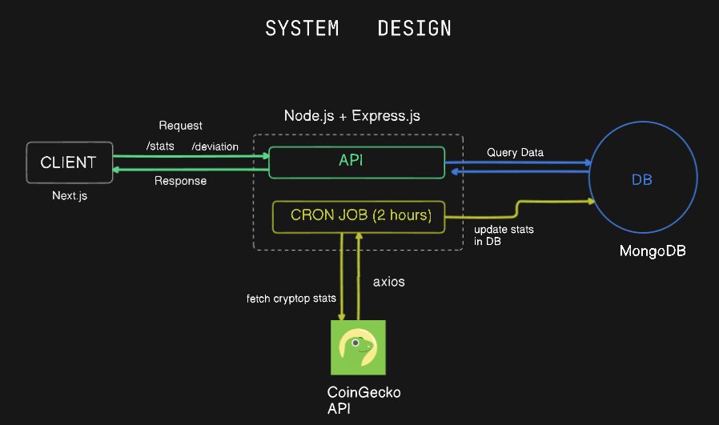

# Crypto Data API Project

## Overview
This project implements a RESTful API for retrieving and analyzing cryptocurrency data. The API allows users to fetch real-time statistics for various cryptocurrencies, calculate the standard deviation of their prices, and regularly update the data from an external source.



## Features
- **Fetch Cryptocurrency Statistics**: Retrieve the latest price, market capitalization, and 24-hour change for specified cryptocurrencies (Bitcoin, Ethereum, Matic).
- **Calculate Standard Deviation**: Calculate the standard deviation of the last 100 price records for a specified cryptocurrency.
- **Automated Data Fetching**: A scheduled job fetches cryptocurrency data every two hours from an external API (CoinGecko) and updates the database.
- **Error Handling**: Custom error handling middleware to manage API errors gracefully.
- **Input Validation**: Validate user inputs for fetching cryptocurrency statistics using express-validator.
- **Rate Limiting**: Implement rate limiting to prevent abuse of the API.
- **CORS Support**: Enable Cross-Origin Resource Sharing to allow requests from different origins.

## Technologies Used
- **Node.js**: JavaScript runtime for building server-side applications.
- **Express.js**: Web framework for Node.js to handle API routing and middleware.
- **Mongoose**: ODM (Object Data Modeling) library for MongoDB and Node.js.
- **MongoDB**: NoSQL database for storing cryptocurrency data.
- **Axios**: Promise-based HTTP client for making requests to the CoinGecko API.
- **Math.js**: Library for mathematical operations, used for calculating standard deviation.
- **Node-Cron**: Library for scheduling tasks in Node.js.
- **Express Validator**: Middleware for validating request data.
- **CORS**: Middleware for enabling CORS in Express applications.
- **dotenv**: Module to load environment variables from a `.env` file.

## Project Structure
```
├── controllers
│   └── crypto.controllers.js
├── jobs
│   └── crypto.jobs.js
├── middleware
│   └── errorHandler.js
├── models
│   └── crypto.schema.js
├── routes
│   └── crypto.routes.js
├── utils
│   ├── asyncWrapper.js
│   └── db.js
├── .env
├── package.json
└── server.js
```

## Setup and Installation
1. Clone the repository:
   ```bash
   git clone <repository-url>
   cd <repository-directory>
   ```
2. Install the dependencies:
   ```bash
   npm install
   ```
3. Create a `.env` file in the root directory and add the following variables:
   ```env
   PORT=5000
   COINGECKO_API_URL=https://api.coingecko.com/api/v3/simple/price
   ORIGIN=http://localhost:3000
   ```
4. Start the server:
   ```bash
   npm start
   ```

## API Endpoints
### 1. Get Cryptocurrency Statistics
- **Endpoint**: `/api/stats`
- **Method**: `GET`
- **Query Parameters**:
  - `coin`: The name of the cryptocurrency (e.g., `bitcoin`, `ethereum`, `matic-network`).
- **Response**:
  ```json
  {
    "price": <current_price>,
    "marketCap": <market_cap>,
    "24hChange": <change_24h>
  }
  ```

### 2. Get Standard Deviation
- **Endpoint**: `/api/deviation`
- **Method**: `GET`
- **Query Parameters**:
  - `coin`: The name of the cryptocurrency (e.g., `bitcoin`, `ethereum`, `matic-network`).
- **Response**:
  ```json
  {
    "deviation": <standard_deviation>
  }
  ```

## Error Handling
The API utilizes a custom error handling middleware to catch and respond to errors. Errors are returned in the following format:
```json
{
  "status": "error",
  "message": "<error_message>"
}
```

## Conclusion
This Crypto Data API provides a robust solution for accessing and analyzing cryptocurrency data with features that ensure reliability and performance. Future enhancements could include additional endpoints, user authentication, and integration with more cryptocurrency data sources.
